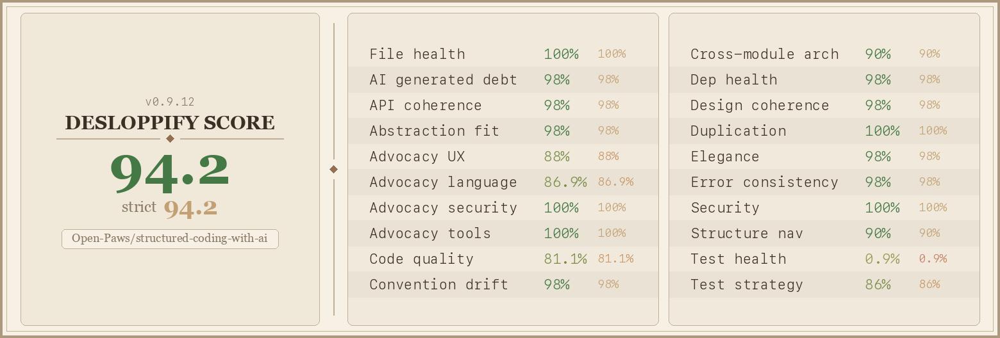

[](LICENSE)
[](scorecard.png)
[](https://github.com/Open-Paws/structured-coding-with-ai/commits/main)
[](https://github.com/Open-Paws/structured-coding-with-ai/actions/workflows/integrity-check.yml)
[](https://github.com/Open-Paws/structured-coding-with-ai/actions/workflows/no-animal-violence.yml)

# Structured Coding with AI — Open Paws

Ready-to-use instruction file sets for 12 AI coding tools, built for developers working on animal advocacy software. Copy one directory into your project root and your AI assistant immediately understands the advocacy domain: three-adversary security threat model, activist identity protection, farmed animal terminology, and workflow standards. No external dependencies — just files.

Maintained by [Open Paws](https://openpaws.ai), a 501(c)(3) nonprofit building AI infrastructure for the animal liberation movement.

> [!NOTE]
> This project is part of the [Open Paws](https://openpaws.ai) ecosystem — AI infrastructure for the animal liberation movement. [Explore the full platform →](https://github.com/Open-Paws)

---

## Directory Structure

```
structured-coding-with-ai/
├── agents-md/          # AGENTS.md — vendor-neutral, 20+ tool support
├── aider/              # CONVENTIONS.md
├── augment-code/       # .augment/rules/ (14 files)
├── claude-code/        # CLAUDE.md + .claude/rules/ + .claude/skills/ (17 files)
├── cline/              # .clinerules/ (14 files)
├── cursor/             # .cursorrules + .cursor/rules/ (14 files)
├── gemini-cli/         # GEMINI.md
├── graze-cli/          # GRAZE.md — Open Paws opencode fork (multi-provider failover, advocacy kernel)
├── github-copilot/     # .github/ instructions, prompts, chat modes (23 files)
├── jetbrains-junie/    # .junie/guidelines.md
├── kilo-code/          # .kilocode/rules/ + Memory Bank (21 files)
├── roo-code/           # .roomodes + .roo/rules/ (19 files)
├── windsurf/           # .windsurf/rules/ (14 files)
└── scripts/            # Unicode integrity checker
```

---

## Quickstart

1. **Clone the repo**
   ```bash
   git clone https://github.com/Open-Paws/structured-coding-with-ai.git
   ```

2. **Pick your tool** from the table below and copy its directory into your project root

3. **Claude Code example**
   ```bash
   cp claude-code/CLAUDE.md your-project/
   cp claude-code/hooks-template.md your-project/
   cp -r claude-code/.claude your-project/
   ```

4. **Add your project specifics** — build commands, language conventions, tech stack. The instruction files provide methodology; they do not replace project-specific setup.

5. **Verify integrity** before committing instruction file edits
   ```bash
   python scripts/check-unicode-integrity.py
   ```

Full copy commands for every tool are listed in the [Tool Reference](#tool-reference) section below.

---

## Tools Covered

| Tool | Directory | Files | Format |
|------|-----------|------:|--------|
| Claude Code | `claude-code/` | 17 | CLAUDE.md + scoped rules + skills + hooks template |
| Cursor | `cursor/` | 14 | .cursorrules + .mdc files with 4 activation modes |
| GitHub Copilot | `github-copilot/` | 23 | copilot-instructions.md + instructions + prompts + chat modes + skills |
| Windsurf | `windsurf/` | 14 | .windsurf/rules/ with 4 trigger types, within 6K/12K char limits |
| Kilo Code | `kilo-code/` | 21 | Mode files + Memory Bank + concern files + skills |
| Cline | `cline/` | 14 | .clinerules/ with Plan/Act paradigm |
| Roo Code | `roo-code/` | 19 | .roomodes JSON + mode rules + concern files + skills |
| Augment Code | `augment-code/` | 14 | .augment/rules/ directory |
| Aider | `aider/` | 1 | Single CONVENTIONS.md |
| Gemini CLI | `gemini-cli/` | 1 | Single GEMINI.md |
| JetBrains / Junie | `jetbrains-junie/` | 1 | Single .junie/guidelines.md, always loaded |
| AGENTS.md | `agents-md/` | 1 | Vendor-neutral, supported by 20+ tools |
| **Total** | | **140** | |

---

## Content Coverage

Every tool directory covers the same material, adapted to its native format. Tools with multi-file support split content into separate files with appropriate activation triggers. Single-file tools condense everything into clearly-headed sections.

### 7 Concerns (in every tool)

- **Testing** — Spec-first generation, mutation testing, assertion quality over coverage percentage
- **Security** — Three-adversary threat model (state surveillance, industry infiltration, AI model bias), zero-retention APIs, supply chain verification, device seizure preparation
- **Privacy** — Activist identity protection, coalition data sharing, whistleblower protection, real deletion (not soft delete)
- **Cost optimization** — Model routing, token budgets, prompt caching, vendor lock-in as movement risk
- **Advocacy domain** — Ubiquitous language dictionary, bounded contexts for investigation ops / public campaigns / coalition coordination / legal defense
- **Accessibility** — i18n from day one, offline-first, low-bandwidth, low-literacy design
- **Emotional safety** — Progressive disclosure of traumatic content, configurable detail levels, secondary trauma mitigation for developers

### 6 Process Skills (invoked on demand)

- **git-workflow** — Issue-first GitHub workflow with worktree-per-task, plan-review-implement loop, desloppify gate
- **testing-strategy** — Spec-first generation, five anti-patterns to avoid, mutation-guided improvement
- **requirements-interview** — Structured stakeholder questions covering threat model, coalition needs, user safety
- **plan-first-development** — Spec, design, decompose, implement one subtask at a time
- **code-review** — Layered review pipeline, Ousterhout red flags, AI-specific failure patterns, advocacy data leak checks
- **security-audit** — Advocacy threat model assessment, slopsquatting defense, prompt injection detection, MCP server security

### External Contribution Safety

All 12 directories include a two-state identity model: **advocacy mode** for Open Paws repos (full domain context active) and **neutral mode** for external open-source contributions (org identity suppressed, no advocacy framing in commits or PRs). This prevents AI agents from inadvertently identifying contributors or leaking organizational context when contributing to third-party projects.

---

## Tool Reference

<details>
<summary>Copy commands for all 12 tools</summary>

```bash
# Claude Code
cp claude-code/CLAUDE.md your-project/
cp claude-code/hooks-template.md your-project/
cp -r claude-code/.claude your-project/

# Cursor
cp cursor/.cursorrules your-project/
cp -r cursor/.cursor your-project/

# GitHub Copilot
cp -r github-copilot/.github your-project/

# Windsurf
cp -r windsurf/.windsurf your-project/

# Kilo Code
cp -r kilo-code/.kilocode your-project/

# Cline
cp -r cline/.clinerules your-project/

# Roo Code
cp roo-code/.roomodes your-project/
cp -r roo-code/.roo your-project/

# Augment Code
cp -r augment-code/.augment your-project/

# Aider
cp aider/CONVENTIONS.md your-project/

# Gemini CLI
cp gemini-cli/GEMINI.md your-project/

# JetBrains / Junie
cp -r jetbrains-junie/.junie your-project/

# AGENTS.md (universal fallback, 20+ tool support)
cp agents-md/AGENTS.md your-project/
```

</details>

---

## Architecture

<details>
<summary>How instruction files are structured across tools</summary>

Each tool directory is self-contained and independently authored for its format — not a template applied 12 times.

**Multi-file tools** (Claude Code, Cursor, GitHub Copilot, Windsurf, Kilo Code, Cline, Roo Code, Augment Code) break content into separate files with activation triggers:
- Always-on files: core methodology, ubiquitous language, security baseline
- Conditionally loaded files: concern-specific rules triggered by file path or AI decision
- On-demand files: process skill guides invoked explicitly

**Single-file tools** (Aider, Gemini CLI, JetBrains/Junie, AGENTS.md) condense all 7 concerns and 6 skills into clearly-headed sections within one file.

**GitHub Copilot** has the richest hierarchy: `copilot-instructions.md` (repo-wide), `instructions/` (path-specific with `applyTo:`), `prompts/` (reusable workflows), `chat-modes/` (persistent agent personas), and `skills/`.

**Roo Code** uses `.roomodes` JSON to define custom modes (Review, Interview) with tool restrictions and model assignments per mode.

**Windsurf** enforces hard limits of 6,000 characters per file and 12,000 characters combined across loaded files. Always-on files are budgeted to ~8K total to leave headroom for conditionally loaded files.

**Integrity protection**: All instruction files are checked on every PR for hidden Unicode characters (the Rules File Backdoor attack). Run `python scripts/check-unicode-integrity.py` locally before pushing any edits to instruction files.

**Ecosystem position**: This repo is the canonical AI methodology source for all Open Paws projects. It feeds two downstream consumers:
- [graze-cli](https://github.com/Open-Paws/graze-cli) — bundles selected instruction files into its binary
- [desloppify](https://github.com/Open-Paws/desloppify) — generates agent skill files from the same content

```
structured-coding-with-ai  (canonical AI methodology)
        |
        +-- graze-cli          bundles instruction files into CLI binary
        |
        +-- desloppify         generates agent skill files from content
        |
        +-- gary               autonomous agent uses these as base instructions
        |
        +-- platform           copies claude-code/ into project root
        |
        +-- (all Open Paws     copy relevant tool directory into
             project repos)    their own project roots
```

</details>

---

## Documentation

- [Claude Code directory README](claude-code/README.md) — file-by-file description and copy commands
- [scripts/check-unicode-integrity.py](scripts/check-unicode-integrity.py) — integrity checker for instruction files
- [Open Paws developer docs](https://openpaws.ai) — platform documentation

---

## Code Quality



## Contributing

The most valuable contribution is a new tool directory. If you use an AI coding tool not listed here, add it:

1. Create `tool-name/` at the repo root
2. Implement all 7 concerns in the tool's native format
3. Implement all 6 process skills in the tool's native format
4. Add external contribution safety content (two-state identity model)
5. Add a `README.md` inside the directory with file descriptions and copy commands
6. Add a row to the tools table in this README
7. Run `python scripts/check-unicode-integrity.py` before opening a PR
8. Each tool must be independently authored for its format — do not copy content verbatim from another tool and relabel it

Each tool must cover advocacy-domain content: farmed animal terminology, the three-adversary security model, activist identity protection, and emotional safety for developers. Generic instruction files without advocacy context do not meet the bar for this repo.

---

## License and Acknowledgments

[MIT](LICENSE) — Copyright (c) 2024–2026 Open Paws. Copy freely, modify for your context, no attribution required.

Content across all 12 tool sets was derived from a knowledge base covering empirical research on AI-assisted development, software design principles (Ousterhout, Feathers, DDD), testing strategy, git workflow for AI-generated code, and operational security for the animal advocacy domain.

---

```yaml
tech_stack: [markdown, python]
project_status: stable
difficulty: beginner
skill_tags: [ai-coding, instruction-files, animal-advocacy, security, developer-tooling]
related_repos:
  - https://github.com/Open-Paws/graze-cli
  - https://github.com/Open-Paws/desloppify
  - https://github.com/Open-Paws/gary
  - https://github.com/Open-Paws/platform
  - https://github.com/Open-Paws/no-animal-violence
```

---

[Donate](https://openpaws.ai/donate) · [Discord](https://discord.gg/openpaws) · [openpaws.ai](https://openpaws.ai) · [Volunteer](https://openpaws.ai/volunteer)
